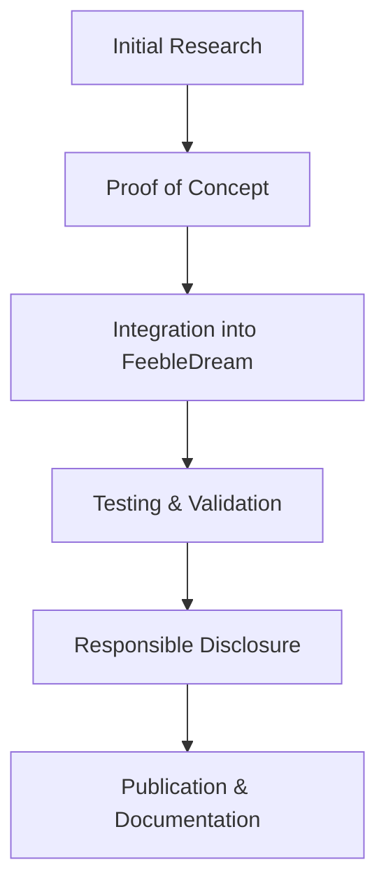

# 👋 Hello, I'm Priyan

[](https://SplineUser.github.io)

## 🔐 Security Research & Engineering

**Computer Science Engineering Student** passionate about offensive and defensive cybersecurity research. I specialize in advanced threat simulation, evasion techniques, and low-level system security.

### 🎯 Research Focus Areas

```
🔍 Advanced Persistent Threat (APT) Development
🛡️ EDR/AV Evasion & Sandbox Detection
🔧 Kernel-Level Security Research (Ring 0)
💻 Malware Analysis & Reverse Engineering
🎵 Novel C2 Communication Methods
⚡ Exploit Development & Vulnerability Research
```

## 🛠️ Technical Arsenal

### Programming Languages


### Security Tools & Frameworks
- **Reverse Engineering**: Ghidra, WinDBG, IDA Pro
- **Web Security**: Burp Suite, Custom Fuzzers
- **Malware Analysis**: Custom toolchain development
- **Kernel Development**: Driver research, IOCTL hunting
- **Cryptography**: AES encryption, XOR schemes, API hashing

## 🔬 Current Research Projects

### 🎭 Advanced Evasion Techniques
- **Sandbox Detection & Bypass**: Multi-layered detection mechanisms
- **Memory Manipulation**: Two-phased permissions (RW → X), in-memory execution
- **Signature Evasion**: Polymorphic code generation, binary stripping

### 🎵 Novel C2 Communication
- **Audio-based Payloads**: .wav file modulation for covert storage
- **YouTube Audio C2**: Innovative command channel via audio signatures
- **Steganographic Methods**: Image and audio-based data exfiltration

### ⚡ Kernel Security Research
- **BYOVD Techniques**: Bring Your Own Vulnerable Driver exploitation
- **Hardware Security**: IOMMU bypass research, PCI manipulation
- **Anti-Virus Targeting**: Research on security driver vulnerabilities

## 📈 Research Methodology



## 🏆 Certifications & Achievements

🎓 **Google Cybersecurity Certificate** - Coursera  
📊 **VirusTotal Research**: Consistently achieving 0/72 detection rates  
🔍 **Vulnerability Research**: Active in responsible disclosure programs

## 📝 Knowledge Sharing

### Recent Work
- Advanced EDR Evasion Techniques
- Kernel-Level Persistence Mechanisms  
- Novel C2 Communication Channels
- Audio Steganography in Malware
- IOMMU Mapping for Misconfiguration
- RIP manipulation for greater device exposure
- BYOVD Hunting with several 0-days and rediscoveries found

*Visit my [blog](https://SplineUser.github.io) for detailed technical writeups and research findings.*

## 🔄 Current Focus

```python
class SecurityResearcher:
    def __init__(self):
        self.current_focus = [
            "Advanced Persistent Threat simulation",
            "Zero-day research and exploitation",
            "Novel evasion technique development",
            "Kernel security mechanisms"
        ]
    
    def research_philosophy(self):
        return "Understand to defend, simulate to improve"
```

## 📊 GitHub Stats


## 🤝 Collaboration & Contact

I'm always interested in collaborating on:
- 🔐 Security research projects
- 🛡️ Defensive tool development  
- 📚 Educational security content
- 🔍 Vulnerability research initiatives

### 📬 Let's Connect!
- 📧 Email: [Priyan29@pm.me]
- 📝 Blog: [SplineUser.github.io](https://SplineUser.github.io)

---

<div align="center">

**"In security research, understanding the attack is the first step to building better defenses"**


</div>
